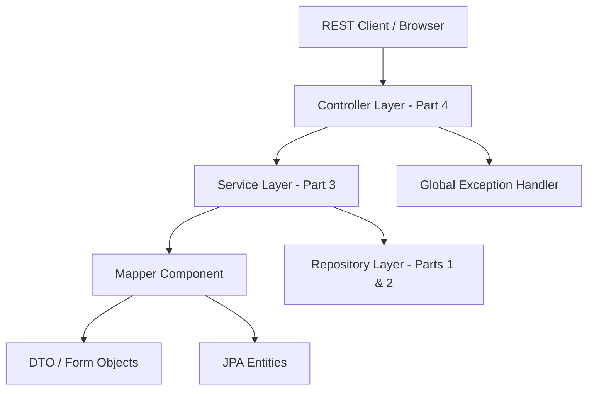
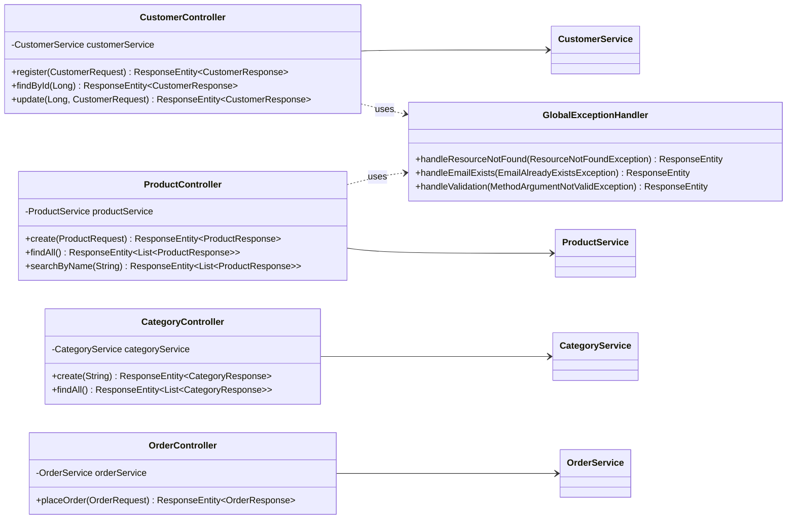

# Workshop: E-commerce Platform (Part 4)

## Objective

Evolve the system by implementing the **Controller Layer**, introducing **RESTful API endpoints**, and utilizing **Exception Handling** to create a complete and functional web service.

## Project Setup & Verification

This section continues from **Part 3**. Before implementing the controller layer:

1. **Create a new branch for Part 4**
2. **Review Dependencies**: Ensure the following dependencies are in `pom.xml`:
    - `spring-boot-starter-webmvc`
    - `spring-boot-starter-validation`
    - `springdoc-openapi-starter-webmvc-ui` (for API documentation):
      ```xml
      <dependency>
          <groupId>org.springdoc</groupId>
          <artifactId>springdoc-openapi-starter-webmvc-ui</artifactId>
          <version>2.8.5</version>
      </dependency>
      ```
      Compatibility note: the example above targets Spring Boot 3. This project
      uses Spring Boot 4 and implements Task 3 with SpringDoc `3.1.1` instead.
3. **Verify App Start**: Run the application and ensure no errors are present.

---

## Architectural Overview: Layered Architecture

In Part 4, we complete the layered architecture by adding the **Controller Layer**. This layer will be responsible for receiving HTTP requests, validating input data, and returning HTTP responses.



---

## REST Controller Layer: Class Diagram

The following diagram illustrates how our Controllers interact with the Service Layer and the Exception Handler.



---

## Task 1: REST Controller Requirements

Create a package `se.lexicon.ecommerceworkshop.controller`. Annotate each class with `@RestController` and the appropriate `@RequestMapping`.

### 1. CustomerController
- **Base Path**: `/api/v1/customers`
- **Endpoints**:
    - `POST`: Create a new customer using `@RequestBody @Valid CustomerRequest`. Status: `201 Created`.
    - `GET /{id}`: Retrieve a customer by ID. Status: `200 OK`.
    - `PUT /{id}`: Update an existing customer. Status: `200 OK`.

### 2. ProductController
- **Base Path**: `/api/v1/products`
- **Endpoints**:
    - `POST`: Create a new product using `@RequestBody @Valid ProductRequest`. Status: `201 Created`.
    - `GET`: List all products. Status: `200 OK`.
    - `GET /search?name=...`: Search products by name using `@RequestParam`. Status: `200 OK`.

### 3. CategoryController
- **Base Path**: `/api/v1/categories`
- **Endpoints**:
    - `POST`: Create a new category. Status: `201 Created`.
    - `GET`: List all categories. Status: `200 OK`.

### 4. OrderController
- **Base Path**: `/api/v1/orders`
- **Endpoints**:
    - `POST`: Place a new order using `@RequestBody @Valid OrderRequest`. Status: `201 Created`.

---

## Task 2: Global Exception Handling

Implement a centralized exception handling mechanism to ensure your API returns consistent and meaningful error responses across all endpoints.

Implementation complete: the existing `ApiExceptionHandler` uses
`@RestControllerAdvice` and extends `ResponseEntityExceptionHandler`. It retains
domain/validation error messages and handles Spring MVC errors with the same
`application/problem+json` format. Unexpected exceptions are logged server-side
and return a generic `500` response. Twenty-three focused MVC test cases cover
all five controllers and the error-response contract.

---

## Task 3: API Documentation (Swagger UI)

Configure Swagger UI using SpringDoc OpenAPI to provide interactive and auto-generated documentation for your REST API, making it easy to test and explore.

Implementation complete: SpringDoc `3.1.1` generates `/v3/api-docs`, and Swagger
UI is available at `/swagger-ui.html` while the app is running. All five resource
groups and 16 API operations include summaries, request examples, validation
constraints, success schemas, create-operation `Location` headers, and shared
`ProblemDetail` error responses. Four integration tests verify the generated
contract and Swagger UI assets. Live browser verification confirmed the UI
renders and **Try it out** returns `200` with seeded products (2026-10-02).

---

## Learning Goals
- **REST Principles**: Understand HTTP verbs (GET, POST, PUT, DELETE) and status codes.
- **Request Validation**: Use `@Valid` and `@RequestBody` to ensure incoming data is correct.
- **Response Management**: Use `ResponseEntity` to control headers and status codes.
- **Global Error Handling**: Centralize error logic for a consistent API response.

---

## Submission Checklist

Tasks 1–3 are implemented and verified on `prel/rest-api-part4-task1`. Controllers use the existing
project package, `se.lexicon.ecommerce.controller`, and the required `/api/v1`
routes. Task 1 implementation is committed and pushed as `277a1ba`; Task 2 is
committed and pushed as `a2bfa40`. Task 3 implementation and its documentation
updates remain uncommitted and unpushed for review.

- [x] **Git Branch**: Created `prel/rest-api-part4-task1` for Part 4.
- [x] **Controllers**: Implement the required REST controllers with appropriate Spring annotations.
- [x] **Endpoints**: Create the required REST endpoints for CRUD operations and searching.
- [x] **Exception Handling**: Centralized domain, validation, Spring MVC, and unexpected-error responses are implemented and tested.
- [x] **Validation**: Required request DTOs use `@Valid`; integration tests cover invalid customer, product, category, and nested order input.
- [x] **Verification (Tasks 1–3)**: All 59 tests pass with `mvn "-Dmaven.compiler.fork=true" clean test`, including 23 error-response cases and four OpenAPI/Swagger tests (2026-10-02). Live H2 HTTP checks covered all nine required Task 1 operations, their `200`/`201` statuses, response data, and create-operation `Location` headers (2026-09-30).
- [x] **Swagger UI**: Documentation is accessible at `/swagger-ui.html`; live **Try it out** verification returned `200` from the product-list endpoint (2026-10-02).
- [ ] **Commits**: Make descriptive commits for each major step. Tasks 1–2 are committed; Task 3 and its documentation updates remain uncommitted.
- [ ] **Push**: Push the branch to GitHub and provide the link. Tasks 1–2 are pushed to `prel/rest-api-part4-task1`; Task 3 and its documentation updates remain local.

---
